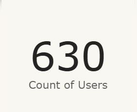
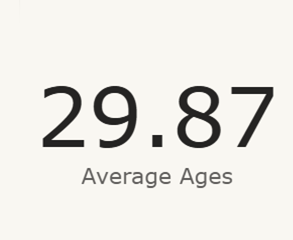
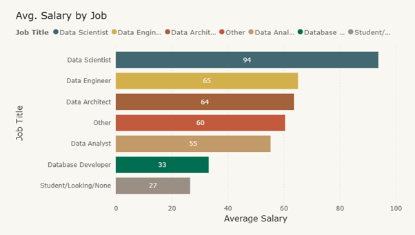
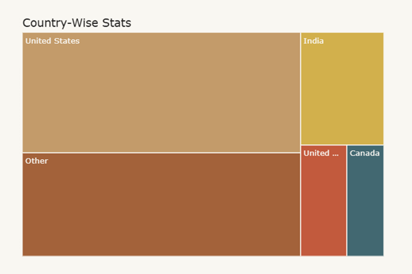
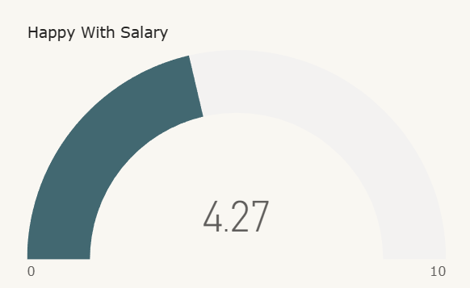
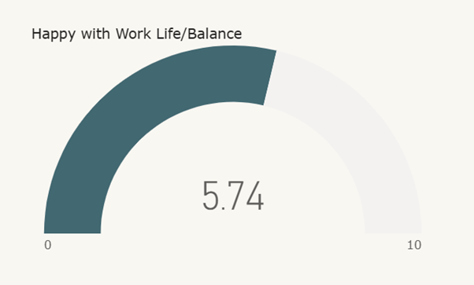
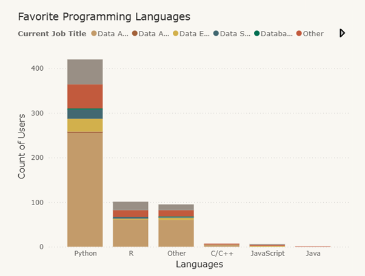
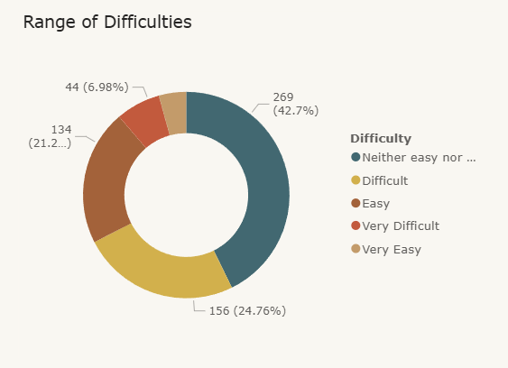
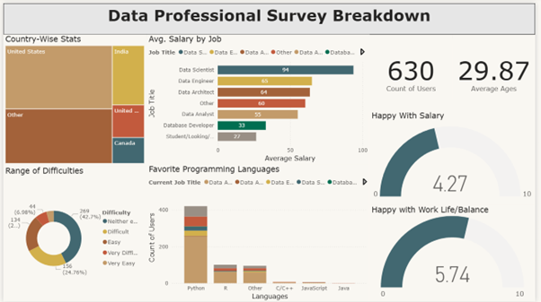

# 📊 Data Jobs Survey Visualization (Power BI)

An **interactive Power BI dashboard** analyzing survey responses from **600+ data professionals** across various roles, providing comprehensive insights into compensation, demographics, job satisfaction, and career trends in the data industry.

---

## 🚀 Key Features

- **📈 Interactive Visualizations** – Dynamic charts with cross-filtering capabilities
- **🌍 Geographic Analysis** – Country-wise filtering with real-time dashboard updates
- **💰 Salary Insights** – Comprehensive compensation analysis by role and location
- **📊 Demographics Overview** – Age distribution and participant statistics
- **🔧 Technology Trends** – Programming language popularity across job roles
- **😊 Satisfaction Metrics** – Work-life balance and salary satisfaction gauges
- **🎯 Career Difficulty Assessment** – Entry-level market analysis for data roles

---

## 📋 Project Overview

### **Dataset Information**
- **Sample Size:** 600+ survey respondents
- **Geographic Scope:** Global (India, United States, United Kingdom, Canada, Others)
- **Job Roles Covered:** Data Scientist, Data Engineer, Data Analyst, Data Architect, and more
- **Key Metrics:** Salary, Age, Satisfaction levels, Programming languages, Career difficulty

### **Business Value**
- Market salary benchmarking for data professionals
- Career guidance for aspiring data scientists
- Industry trend analysis for recruiters and employers
- Geographic insights for remote work decisions

---

## 📊 Dashboard Visualizations

### **1. Survey Participation Overview**
*Total count of survey participants displayed as a key performance indicator*

**Visualization Type:** Card Visual  
**Purpose:** Shows the scale and credibility of the survey data



---

### **2. Demographic Analysis**
*Average age of all survey respondents*

**Visualization Type:** Card Visual  
**Purpose:** Provides demographic context for salary and career insights



---

### **3. Compensation Analysis by Role**
*Comparative salary analysis across different data job titles*

**Visualization Type:** Stacked Bar Chart  
**Key Insights:**
- **Data Scientist** – $93.78k (Highest compensation)
- **Data Engineer** – $65.09k 
- **Data Architect** – $63.67k
- **Other Roles** – $60.49k
- **Data Analyst** – $55.30k
- **Database Developer** – $33.20k
- **Students/Job Seekers** – $26.58k (Entry level)



---

### **4. Geographic Distribution Dashboard**
*Interactive country-wise analysis with dynamic filtering*

**Visualization Type:** TreeMap  
**Interactive Feature:** Selecting any country updates the entire dashboard  
**Coverage:** India, United States, United Kingdom, Canada, Other countries



---

### **5. Salary Satisfaction Gauge**
*Measures respondent happiness with current compensation*

**Visualization Type:** Gauge Chart  
**Purpose:** Assesses overall salary satisfaction across the industry



---

### **6. Work-Life Balance Assessment**
*Evaluates satisfaction with work-life balance in data roles*

**Visualization Type:** Gauge Chart  
**Purpose:** Provides insights into job quality beyond compensation



---

### **7. Programming Language Popularity**
*Distribution of programming languages used across different job roles*

**Visualization Type:** Stacked Column Chart  
**Technology Breakdown:**
- **Python** – 420 users (Most popular)
- **R** – 101 users  
- **Other Languages** – 95 users
- **C/C++** – 7 users
- **JavaScript** – 6 users  
- **Java** – 1 user



---

### **8. Career Entry Difficulty Analysis**
*Assessment of how challenging it is to break into data careers*

**Visualization Type:** Donut/Pie Chart  
**Difficulty Distribution:**
- **Neither easy nor difficult** – 42.7% (Largest segment)
- **Difficult** – 24.76%
- **Easy** – 21.27%  
- **Very difficult** – 6.98%
- **Very easy** – 4.29%



---

## 🖼️ Complete Dashboard Overview

*Full interactive dashboard combining all visualizations*

**Dashboard Features:**
- **Cross-filtering capabilities** across all visuals
- **Country-based dynamic filtering** 
- **Responsive design** for different screen sizes
- **Professional color scheme** and branding



---

## 🎯 Key Business Insights

### **💰 Compensation Trends**
- **Data Scientists command highest salaries** at $93.78k average
- **Significant pay gap** between senior roles and entry-level positions
- **Geographic variations** in compensation packages

### **🔧 Technology Preferences**
- **Python dominates** the data science landscape (420+ users)
- **R remains popular** for statistical analysis (101 users)
- **Diverse skill requirements** across different roles

### **😊 Job Satisfaction**
- **Balanced perspective** on career entry difficulty
- **Work-life balance** varies significantly across roles
- **Salary satisfaction** correlates with experience level

### **🌍 Geographic Distribution**
- **Global representation** with strong presence in major markets
- **Country-specific salary variations** 
- **Regional preferences** for different technologies

---

## 🛠️ Technical Implementation

### **Power BI Features Used**
- **Interactive Visuals** – Cards, Bar Charts, TreeMaps, Gauges
- **Cross-filtering** – Dynamic dashboard updates
- **DAX Calculations** – Average salary computations
- **Data Modeling** – Optimized relationships for performance
- **Custom Formatting** – Professional color schemes and styling

### **Dashboard Optimization**
- **Responsive design** for various screen sizes
- **Efficient data model** for fast loading
- **User-friendly navigation** and filtering
- **Professional visual hierarchy**

---

## 📁 Project Structure

```
data_jobs_survey_powerbi/
├── 📊 Data_Jobs_Survey_Dashboard.pbix    # Main Power BI file
├── 📈 images/                            # Dashboard screenshots
│   ├── user_count_pic.png
│   ├── avg_age_pic.png
│   ├── avg_salary_pic.png
│   ├── country_pic.png
│   ├── happy_with_salary_pic.png
│   ├── happy_with_worklife_balance_pic.png
│   ├── language_pic.png
│   ├── difficulty_range_pic.png
│   └── entire_project_pic.png
├── 📋 survey_data.xlsx                   # Source dataset (optional)
├── .gitattributes                        # GitHub language detection
└── 📖 README.md                          # This documentation
```

---

## 🔮 Future Enhancements

**📊 Advanced Analytics:**
- **Time series analysis** for salary trends over years
- **Predictive modeling** for career progression paths
- **Statistical significance testing** for salary differences
- **Machine learning insights** for job market predictions

**🎨 Visualization Improvements:**
- **Mobile-optimized layouts** for tablet/phone viewing
- **Advanced filtering options** (experience level, education)
- **Drill-through capabilities** for detailed analysis
- **Export functionality** for stakeholder reports

---

## 🎓 Skills Demonstrated

- **📊 Business Intelligence** – Dashboard design and data storytelling
- **🔧 Power BI Expertise** – Advanced visualizations and DAX
- **📈 Data Analysis** – Survey data interpretation and insights
- **🎨 UI/UX Design** – User-friendly dashboard layout
- **📋 Project Documentation** – Comprehensive technical writing

---

## 🙏 Acknowledgments

- Built with **Microsoft Power BI Desktop**
- Survey data representing **600+ data professionals globally**
- Dashboard optimized for **business stakeholders** and **career guidance**
- Follows **data visualization best practices** and **professional design standards**
